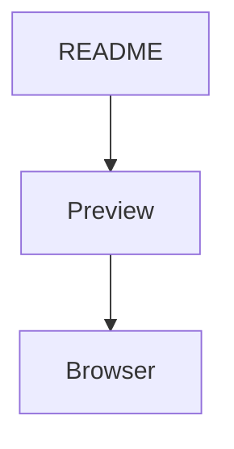

# Basic GitHub Flavored Markdown 

Some paragraph text with **bold** and *italic* and `inline code`.

## Code Block

```python
def hello():
    print("world")
```

## Mermaid



```mermaid
  info
```

## Math

Inline math works: $\sqrt{3x-1} + (1+x)^2$

Inline math with the GitHub backtick delimiter works: $`\int_0^1 x^2 dx`$

$$
\left( \sum_{k=1}^n a_k b_k \right)^2 \le
\left( \sum_{k=1}^n a_k^2 \right)
\left( \sum_{k=1}^n b_k^2 \right)
$$

```math
\nabla \cdot \vec{E} = \frac{\rho}{\varepsilon_0}
```

## Table

| Feature | Status |
|---------|--------|
| Admonitions | Working |
| Dark mode | Working |
| Live reload | Working |

## Admonitions

> [!NOTE]
> This is a note admonition.

> [!TIP]
> This is a tip admonition.

> [!IMPORTANT]
> This is an important admonition.

> [!WARNING]
> This is a warning admonition.

> [!CAUTION]
> This is a caution admonition.

## Regular blockquote

> This is a regular blockquote and should render normally.

## Raw HTML

<details>
<summary>Click to expand</summary>

This is hidden content with <kbd>keyboard</kbd> tags and <sub>subscript</sub>.

</details>

## Task Lists

- [ ] unchecked item
- [x] checked item
- [ ] another unchecked item

## Strikethrough

This has ~~deleted text~~ in it.

## Autolinks

Bare URL: https://example.com

## Footnotes

Here is a sentence with a footnote[^1].

And another[^note].

[^1]: This is the first footnote.
[^note]: This is a named footnote.

## Emoji Shortcodes

:wave: :rocket: :white_check_mark:

## Links and Images

[Example link](https://example.com)

---

*End of test*
