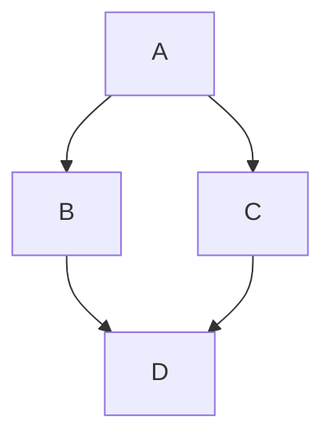

# Creating diagrams

Create diagrams to convey information through charts and graphs.

## About creating diagrams

You can create diagrams in Markdown using three different syntaxes: mermaid, geoJSON, and topoJSON. Diagram rendering is available in GitHub Issues, GitHub Discussions, pull requests, wikis, and Markdown files.

## Creating Mermaid diagrams

Mermaid is a Markdown-inspired tool that renders text into diagrams. For example, Mermaid can render flow charts, sequence diagrams, pie charts and more. For more information, see the [Mermaid documentation](https://mermaid-js.github.io/mermaid/#/).

To create a Mermaid diagram, add Mermaid syntax inside a fenced code block with the `mermaid` language identifier. For more information about creating code blocks, see [Creating and highlighting code blocks](https://docs.github.com/en/get-started/writing-on-github/working-with-advanced-formatting/creating-and-highlighting-code-blocks).

For example, you can create a flow chart by specifying values and arrows.

### Raw

````text
Here is a simple flow chart:


````

### Screenshot (GitHub)


### Live Rendering


> \[!NOTE]
> You may observe errors if you run a third-party Mermaid plugin when using Mermaid syntax on GitHub.

### Checking your version of Mermaid

To ensure GitHub supports your Mermaid syntax, check the Mermaid version currently in use.

### Raw

````text
```mermaid
  info
```
````

### Live Rendering

```mermaid
  info
```

## Creating GeoJSON and TopoJSON maps

You can use GeoJSON or TopoJSON syntax to create interactive maps. To create a map, add GeoJSON or TopoJSON inside a fenced code block with the `geojson` or `topojson` syntax identifier. For more information, see [Creating and highlighting code blocks](https://docs.github.com/en/get-started/writing-on-github/working-with-advanced-formatting/creating-and-highlighting-code-blocks).

### Using GeoJSON

For example, you can create a map by specifying coordinates.

````text
```geojson
{
  "type": "FeatureCollection",
  "features": [
    {
      "type": "Feature",
      "id": 1,
      "properties": {
        "ID": 0
      },
      "geometry": {
        "type": "Polygon",
        "coordinates": [
          [
              [-90,35],
              [-90,30],
              [-85,30],
              [-85,35],
              [-90,35]
          ]
        ]
      }
    }
  ]
}
```
````

### Screenshot (GitHub)


### Live Rendering

```geojson
{
  "type": "FeatureCollection",
  "features": [
    {
      "type": "Feature",
      "id": 1,
      "properties": {
        "ID": 0
      },
      "geometry": {
        "type": "Polygon",
        "coordinates": [
          [
              [-90,35],
              [-90,30],
              [-85,30],
              [-85,35],
              [-90,35]
          ]
        ]
      }
    }
  ]
}
```


### Using TopoJSON

For example, you can create a TopoJSON map by specifying coordinates and shapes.

### Raw

````text
```topojson
{
  "type": "Topology",
  "transform": {
    "scale": [0.0005000500050005, 0.00010001000100010001],
    "translate": [100, 0]
  },
  "objects": {
    "example": {
      "type": "GeometryCollection",
      "geometries": [
        {
          "type": "Point",
          "properties": {"prop0": "value0"},
          "coordinates": [4000, 5000]
        },
        {
          "type": "LineString",
          "properties": {"prop0": "value0", "prop1": 0},
          "arcs": [0]
        },
        {
          "type": "Polygon",
          "properties": {"prop0": "value0",
            "prop1": {"this": "that"}
          },
          "arcs": [[1]]
        }
      ]
    }
  },
  "arcs": [[[4000, 0], [1999, 9999], [2000, -9999], [2000, 9999]],[[0, 0], [0, 9999], [2000, 0], [0, -9999], [-2000, 0]]]
}
```
````

### Screenshot (GitHub)


### Live Rendering

```topojson
{
  "type": "Topology",
  "transform": {
    "scale": [0.0005000500050005, 0.00010001000100010001],
    "translate": [100, 0]
  },
  "objects": {
    "example": {
      "type": "GeometryCollection",
      "geometries": [
        {
          "type": "Point",
          "properties": {"prop0": "value0"},
          "coordinates": [4000, 5000]
        },
        {
          "type": "LineString",
          "properties": {"prop0": "value0", "prop1": 0},
          "arcs": [0]
        },
        {
          "type": "Polygon",
          "properties": {"prop0": "value0",
            "prop1": {"this": "that"}
          },
          "arcs": [[1]]
        }
      ]
    }
  },
  "arcs": [[[4000, 0], [1999, 9999], [2000, -9999], [2000, 9999]],[[0, 0], [0, 9999], [2000, 0], [0, -9999], [-2000, 0]]]
}
```

For more information on working with `.geojson` and `.topojson` files, see [Working with non-code files](https://docs.github.com/en/repositories/working-with-files/using-files/working-with-non-code-files#mapping-geojson-files-on-github).

## STL 3D models

STL examples were dropped from this fixture because GitHub does not present them consistently as an inline Markdown embed here.
